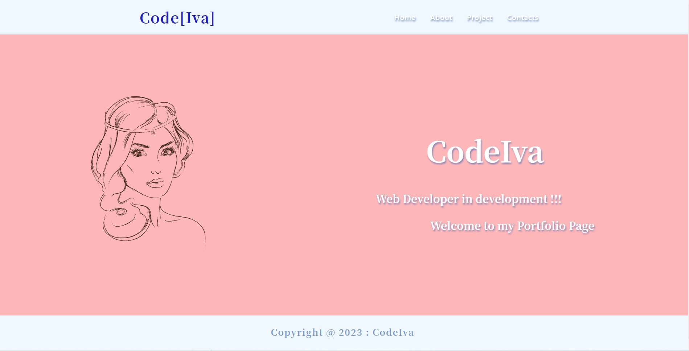

# My Portfolio

## Table of content
  - [Description](#description) 
  - [Screenshot](#screenshot) 
  - [Links](#links)
  - [Installation](#installation)
  - [Tests](#tests)
  - [License](#license)

  
## Description
  This is my React portfolio. The project I am using React, JavaScript and CSS. In the project section I have added some of my applications to demonstrate my the skills.

## Screenshot
 



## Links

- Solution URL: [Solution URL here](https://github.com/KodeIva/my-portfolio)
- Live Site URL: [Live site URL here](https://kodeiva.github.io/my-portfolio/#/my-portfolio/)


## Installations
  ```
    npx create-react-app
    npm install react react-dom
    npm install gh-pages 
  ```

## Deployment
  ```
    npm run deploy

  ```


## Technologies 
 - JavaScript
 - React
 - CSS


## Tests  
 - N/A
 

## License
  [](https://opensource.org/licenses/MIT) 